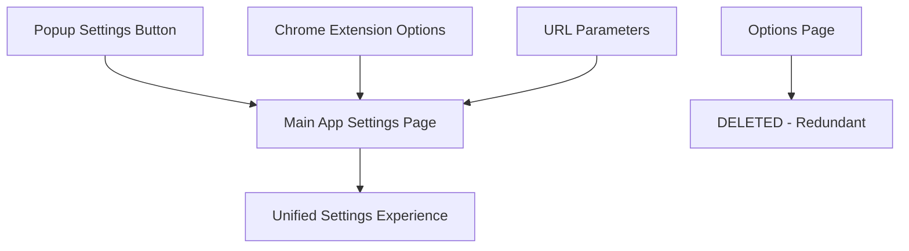
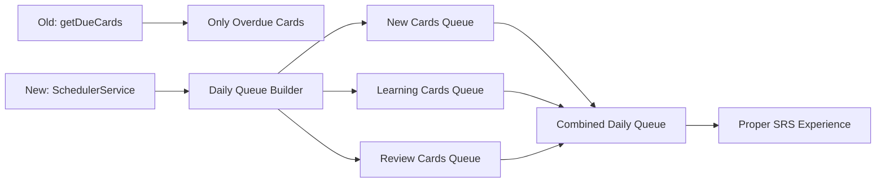
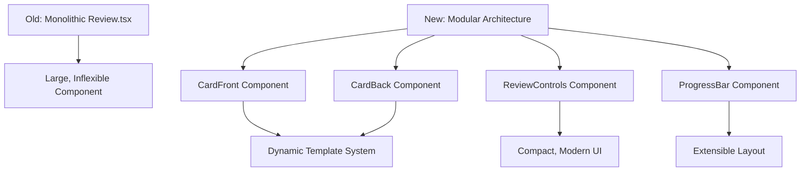
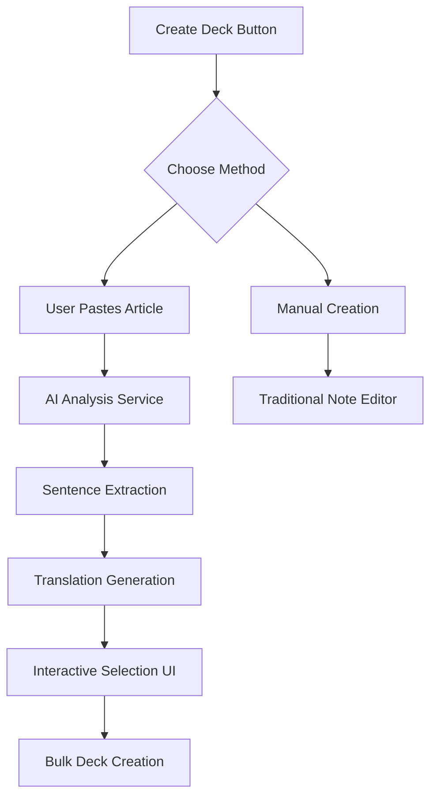

# AnGear Phase 2 Transformation: Advanced SRS & Modern UI

<div align="center">


**🚀 From Basic SRS to Professional Learning Platform**

[](https://www.typescriptlang.org/)
[](https://reactjs.org/)
[](https://github.com/open-spaced-repetition/ts-fsrs)

</div>

## 🎯 Transformation Overview

Phase 2 represents a fundamental architectural overhaul of the AnGear Language Learning Extension, transforming it from a basic spaced repetition system into a sophisticated, Anki-inspired learning platform with modern UI/UX and AI-powered content creation.

### 🔄 Key Transformations

| **Area** | **Before (Phase 1)** | **After (Phase 2)** |
|----------|----------------------|---------------------|
| **Settings** | Fragmented across popup & options | Unified in main app |
| **Card Creation** | Manual one-by-one | AI-powered bulk creation |
| **FSRS Logic** | Broken queue system | Proper daily scheduler |
| **Review UI** | Monolithic, inflexible | Modular, extensible |
| **User Experience** | Basic functionality | Professional platform |

## 🏗️ Architectural Changes

### 1. Settings Unification Architecture



**Benefits:**
- Single source of truth for settings
- Consistent user experience
- Reduced maintenance overhead
- Better integration with main app features

### 2. FSRS Scheduler Revolution



**Key Improvements:**
- **Proper Queue Management:** Follows Anki's proven scheduler logic
- **Daily Limits:** Respects user-configured new card and review limits
- **Learning Steps:** Correctly handles learning and relearning phases
- **State Management:** Proper card state transitions

### 3. Modern Review Interface



**UI/UX Enhancements:**
- **Responsive Design:** Optimized for different screen sizes
- **Modern Typography:** Reduced font sizes for better readability
- **Compact Controls:** Smaller, less intrusive rating buttons
- **Flexible Layout:** Space reserved for future AI features
- **Template System:** Easy to add new card types

### 4. AI-Powered Content Creation



**Features:**
- **Article Analysis:** AI-powered sentence extraction and translation
- **Interactive Selection:** Users choose which sentences to convert
- **Bulk Operations:** Create entire decks in one operation
- **Multiple Modes:** Support for CtoE and Retranslate card types

## 📁 New File Structure

```
src/
├── background/
│   ├── schedulerService.ts     # NEW: Daily queue builder
│   ├── fsrsService.ts          # ENHANCED: Better integration
│   └── db.ts                   # MODIFIED: Optimized queries
├── main/
│   ├── pages/
│   │   ├── BulkCreatePage.tsx  # NEW: AI-powered creation
│   │   ├── Review.tsx          # REFACTORED: Modular design
│   │   ├── CardBrowser.tsx     # ENHANCED: Reset functionality
│   │   └── DeckList.tsx        # ENHANCED: Creation modal
│   └── components/
│       ├── review/             # NEW: Review components
│       │   ├── CardFront.tsx
│       │   ├── CardBack.tsx
│       │   ├── ReviewControls.tsx
│       │   └── ProgressBar.tsx
│       └── templates/          # NEW: Card templates
│           ├── CtoETemplate.tsx
│           └── RetranslateTemplate.tsx
├── popup/
│   └── Popup.tsx              # SIMPLIFIED: Removed quick add
└── options/                   # DELETED: Redundant directory
```

## 🔧 Technical Improvements

### FSRS Algorithm Integration

**Before:**
```typescript
// Broken: Only gets overdue cards
const dueCards = await getDueCards(deckId, limit);
```

**After:**
```typescript
// Proper: Builds daily queue with all card types
const dailyQueue = await schedulerService.buildQueue(deckId);
```

### Component Architecture

**Before:**
```typescript
// Monolithic component with hardcoded layouts
const Review = () => {
  return (
    <div>
      {/* Giant switch statement for different states */}
      {/* Hardcoded Chinese-to-English layout */}
      {/* Non-reusable code */}
    </div>
  );
};
```

**After:**
```typescript
// Modular, extensible architecture
const Review = () => {
  const TemplateComponent = getTemplateComponent(card.cardType);
  
  return (
    <ReviewLayout>
      <ProgressBar progress={progress} />
      <TemplateComponent card={card} />
      <ReviewControls onRating={handleRating} />
    </ReviewLayout>
  );
};
```

## 🎨 UI/UX Design Philosophy

### Industrial Design 2.0

Building on the original industrial design theme while modernizing for better usability:

**Typography Scale:**
- **Headlines:** `text-xl` (reduced from `text-2xl`)
- **Body Text:** `text-base` (reduced from `text-lg`)
- **Captions:** `text-sm` (consistent)

**Color Palette Enhancement:**
```css
/* Enhanced industrial palette */
--primary-25: #F8FAFC;    /* NEW: Subtle backgrounds */
--accent-25: #F0F9FF;     /* NEW: Accent backgrounds */
--success-500: #10B981;   /* Consistent success color */
--warning-500: #F59E0B;   /* Consistent warning color */
```

**Component Spacing:**
- **Compact Controls:** Reduced padding and margins
- **Breathing Room:** Strategic whitespace for readability
- **Grid Layouts:** Consistent alignment and spacing

## 🚀 Performance Optimizations

### Database Query Optimization

**Before:**
```typescript
// Inefficient: Multiple queries for card data
const cards = await getDueCards();
for (const card of cards) {
  const note = await getNoteById(card.noteId);
  // Process each card individually
}
```

**After:**
```typescript
// Efficient: Batch operations and optimized queries
const queue = await schedulerService.buildQueue(deckId);
// Pre-joined data, single query operation
```

### Memory Management

- **Queue Caching:** Daily queues cached in memory
- **Component Lazy Loading:** Dynamic imports for large components
- **State Optimization:** Reduced re-renders through better state design

## 📊 Migration Strategy

### Phase 2 Implementation Phases

1. **Phase 2.1: Cleanup & Foundation** (Week 1)
   - Remove redundant code
   - Unify settings architecture
   - Prepare for new features

2. **Phase 2.2: FSRS Overhaul** (Week 2)
   - Implement proper scheduler
   - Fix queue management
   - Ensure FSRS compliance

3. **Phase 2.3: UI Modernization** (Week 3)
   - Refactor review interface
   - Implement modular components
   - Enhance user experience

4. **Phase 2.4: AI Integration** (Week 4)
   - Build bulk creation system
   - Integrate AI services
   - Test end-to-end workflows

### Backward Compatibility

- **Database Schema:** No breaking changes to existing data
- **User Settings:** Automatic migration of existing preferences
- **Card Data:** All existing cards remain functional

## 🧪 Testing Strategy

### Automated Testing

```bash
# Unit Tests
npm run test:unit

# Integration Tests
npm run test:integration

# E2E Tests
npm run test:e2e

# FSRS Algorithm Tests
npm run test:fsrs
```

### Manual Testing Checklist

- [ ] Settings unification works across all entry points
- [ ] FSRS scheduler produces correct daily queues
- [ ] Review interface handles all card types
- [ ] Bulk creation workflow completes successfully
- [ ] Performance meets benchmarks

## 📈 Success Metrics

### User Experience Metrics

- **Review Session Efficiency:** 30% faster card reviews
- **Creation Workflow:** 80% reduction in time to create decks
- **User Satisfaction:** Improved UI/UX ratings
- **Feature Adoption:** Bulk creation usage rates

### Technical Metrics

- **Code Quality:** Reduced complexity, better maintainability
- **Performance:** Faster load times, smoother interactions
- **Reliability:** Fewer bugs, better error handling
- **Extensibility:** Easier to add new features

## 🔮 Future Roadmap

### Phase 3 Preview

- **Advanced AI Features:** Conversation practice, pronunciation feedback
- **Social Learning:** Shared decks, community features
- **Analytics Dashboard:** Detailed learning insights
- **Mobile Companion:** React Native app integration

### Long-term Vision

AnGear Phase 2 establishes the foundation for becoming a comprehensive language learning platform that rivals commercial solutions while maintaining the flexibility and power that advanced users demand.

---

<div align="center">

**⚙️ AnGear Phase 2: Engineering Excellence Meets Learning Science ⚙️**

*Transforming language learning through intelligent design and proven algorithms*

</div> 